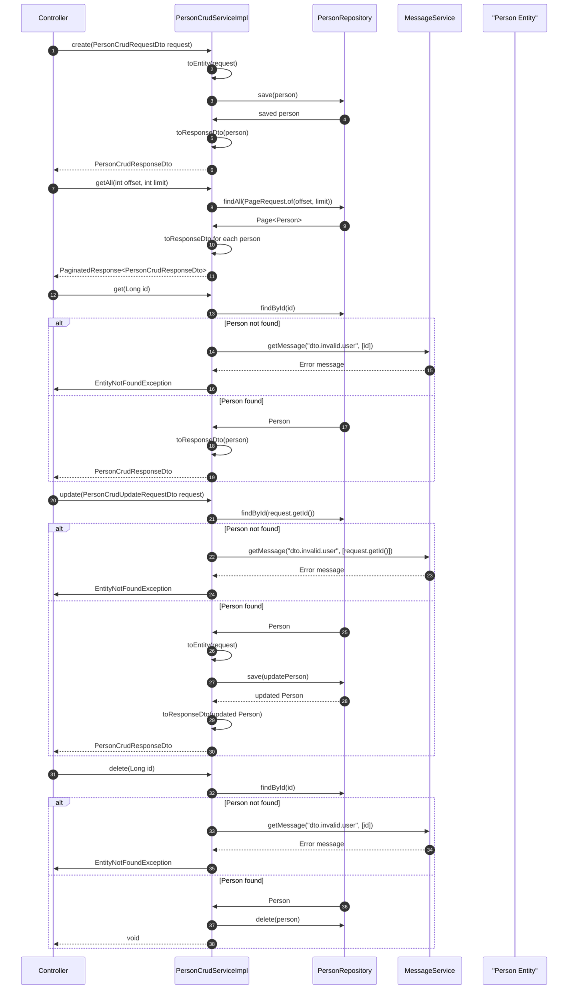

## Person
 

```mermaid
sequenceDiagram
autonumber
participant Controller
participant PersonCrudServiceImpl
participant PersonRepository
participant MessageService
participant Person as "Person Entity"

    Controller->>PersonCrudServiceImpl: create(PersonCrudRequestDto request)
    PersonCrudServiceImpl->>PersonCrudServiceImpl: toEntity(request)
    PersonCrudServiceImpl->>PersonRepository: save(person)
    PersonRepository->>PersonCrudServiceImpl: saved person
    PersonCrudServiceImpl->>PersonCrudServiceImpl: toResponseDto(person)
    PersonCrudServiceImpl-->>Controller: PersonCrudResponseDto

    Controller->>PersonCrudServiceImpl: getAll(int offset, int limit)
    PersonCrudServiceImpl->>PersonRepository: findAll(PageRequest.of(offset, limit))
    PersonRepository->>PersonCrudServiceImpl: Page<Person>
    PersonCrudServiceImpl->>PersonCrudServiceImpl: toResponseDto for each person
    PersonCrudServiceImpl-->>Controller: PaginatedResponse<PersonCrudResponseDto>

    Controller->>PersonCrudServiceImpl: get(Long id)
    PersonCrudServiceImpl->>PersonRepository: findById(id)
    alt Person not found
        PersonCrudServiceImpl->>MessageService: getMessage("dto.invalid.user", [id])
        MessageService-->>PersonCrudServiceImpl: Error message
        PersonCrudServiceImpl->>Controller: EntityNotFoundException
    else Person found
        PersonRepository->>PersonCrudServiceImpl: Person
        PersonCrudServiceImpl->>PersonCrudServiceImpl: toResponseDto(person)
        PersonCrudServiceImpl-->>Controller: PersonCrudResponseDto
    end

    Controller->>PersonCrudServiceImpl: update(PersonCrudUpdateRequestDto request)
    PersonCrudServiceImpl->>PersonRepository: findById(request.getId())
    alt Person not found
        PersonCrudServiceImpl->>MessageService: getMessage("dto.invalid.user", [request.getId()])
        MessageService-->>PersonCrudServiceImpl: Error message
        PersonCrudServiceImpl->>Controller: EntityNotFoundException
    else Person found
        PersonRepository->>PersonCrudServiceImpl: Person
        PersonCrudServiceImpl->>PersonCrudServiceImpl: toEntity(request)
        PersonCrudServiceImpl->>PersonRepository: save(updatePerson)
        PersonRepository-->>PersonCrudServiceImpl: updated Person
        PersonCrudServiceImpl->>PersonCrudServiceImpl: toResponseDto(updated Person)
        PersonCrudServiceImpl-->>Controller: PersonCrudResponseDto
    end

    Controller->>PersonCrudServiceImpl: delete(Long id)
    PersonCrudServiceImpl->>PersonRepository: findById(id)
    alt Person not found
        PersonCrudServiceImpl->>MessageService: getMessage("dto.invalid.user", [id])
        MessageService-->>PersonCrudServiceImpl: Error message
        PersonCrudServiceImpl->>Controller: EntityNotFoundException
    else Person found
        PersonRepository->>PersonCrudServiceImpl: Person
        PersonCrudServiceImpl->>PersonRepository: delete(person)
        PersonCrudServiceImpl-->>Controller: void
    end
```
