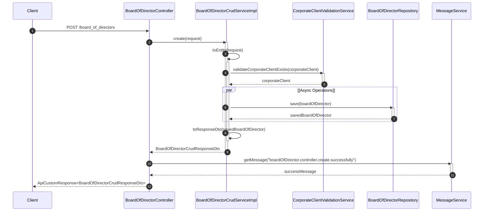

## BoardOfDirector
 

```mermaid

sequenceDiagram
autonumber
participant Client
participant BoardOfDirectorController
participant BoardOfDirectorCrudServiceImpl
participant CorporateClientValidationService
participant BoardOfDirectorRepository
participant MessageService

    Client ->> BoardOfDirectorController: POST /board_of_directors
    BoardOfDirectorController ->> BoardOfDirectorCrudServiceImpl: create(request)
    activate BoardOfDirectorCrudServiceImpl

    BoardOfDirectorCrudServiceImpl ->> BoardOfDirectorCrudServiceImpl: toEntity(request)
    activate BoardOfDirectorCrudServiceImpl

    BoardOfDirectorCrudServiceImpl ->> CorporateClientValidationService: validateCorporateClientExists(corporateClient)
    activate CorporateClientValidationService
    CorporateClientValidationService -->> BoardOfDirectorCrudServiceImpl: corporateClient
    deactivate CorporateClientValidationService

    par [Async Operations]
        BoardOfDirectorCrudServiceImpl ->> BoardOfDirectorRepository: save(boardOfDirector)
        activate BoardOfDirectorRepository
        BoardOfDirectorRepository -->> BoardOfDirectorCrudServiceImpl: savedBoardOfDirector
        deactivate BoardOfDirectorRepository
    end

    BoardOfDirectorCrudServiceImpl ->> BoardOfDirectorCrudServiceImpl: toResponseDto(savedBoardOfDirector)
    deactivate BoardOfDirectorCrudServiceImpl
    BoardOfDirectorCrudServiceImpl -->> BoardOfDirectorController: BoardOfDirectorCrudResponseDto
    deactivate BoardOfDirectorCrudServiceImpl

    BoardOfDirectorController ->> MessageService: getMessage("boardOfDirector.controller.create.successfully")
    activate MessageService
    MessageService -->> BoardOfDirectorController: successMessage
    deactivate MessageService

    BoardOfDirectorController -->> Client: ApiCustomResponse<BoardOfDirectorCrudResponseDto>

```